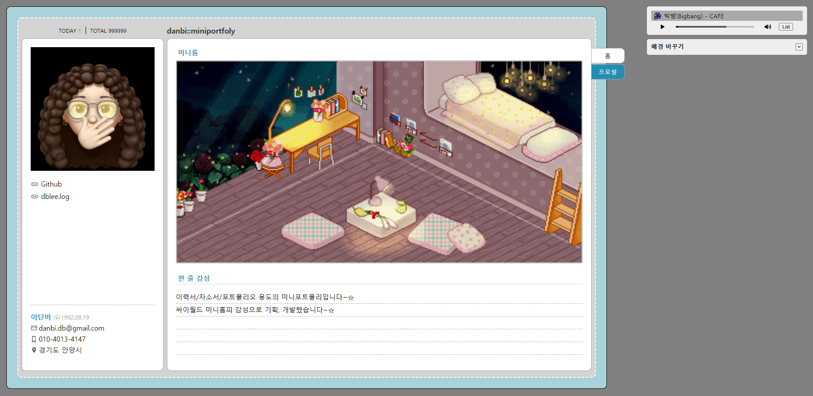
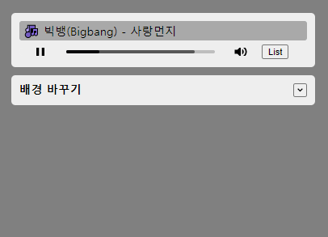
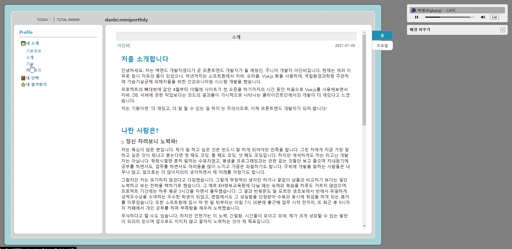
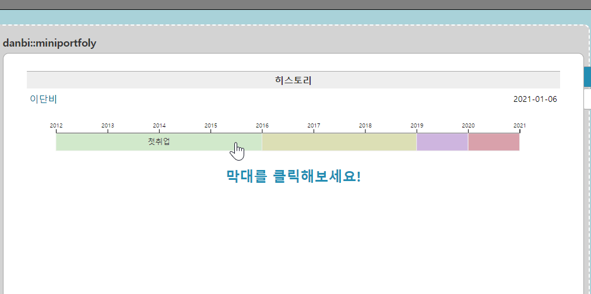

# 리액트로 만든 미니홈피:: 미니포트폴리

- **Concept**: 싸이월드 미니홈피의 레이아웃, 디자인 및 감성을 담았습니다. 
- **Contents**: 실제 미니홈피처럼 개인적인 정보(TMI😅)들을 담았습니다. 

## Table of Contents
- [Technologies](#technologies)  
- [Features](#features) 
  - [BGM](#bgm)
  - [배경 바꾸기](#배경-바꾸기)
  - [스크롤 상단 초기화](#스크롤-상단-초기화)
  - [D3.js](#d3js)

## Technologies
> ❕ 크로스 브라우징 및 반응형은 고려하지 않았습니다.  
> 

## Features

### ◽BGM 
사이트에 접속해 있는 동안 BGM이 끊기지 않고 자동재생 됩니다.

> 아래 이미지를 클릭하면 상세 코드를 확인할 수 있습니다.

### ◽배경 바꾸기
사이트의 배경 및 레이아웃 요소들의 컬러를 변경할 수 있는 기능입니다. 

> 아래 이미지를 클릭하면 상세 코드를 확인할 수 있습니다.

### ◽스크롤 상단 초기화
리액트에서 페이지를 이동하는 경우 이전 페이지의 스크롤 위치가 그대로 남아있게 됩니다. 이를 위해 페이지 이동 시 스크롤을 상단으로 초기화해주는 컴포넌트를 만들어 사용했습니다. 

[코드 확인하기](./docs/features/scrollToTop.md)

### ◽D3.js

D3.js 라이브러리를 이용해 기술과 히스토리 페이지에 차트를 추가했습니다. 

#### 스킬
> 아래 이미지를 클릭하면 상세 코드를 확인할 수 있습니다.

#### 히스토리
> 아래 이미지를 클릭하면 상세 코드를 확인할 수 있습니다.

