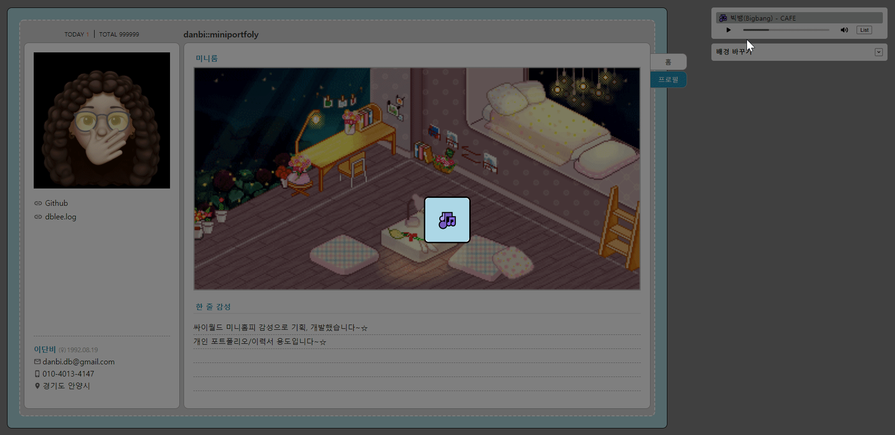

# BGM 

> ⚠ 플레이리스트는 구매 후 개인 소장중인 mp3 파일들로 구성하였습니다. 문제가 있다면 알려주세요!   

> ❗ 재생을 중지해도 플레이리스트가 리렌더링 되면 다시 자동재생이 되는 이슈가 있습니다😂 
---

2018년 4월, UX 개선을 위해 크롬의 자동재생 정책이 아래와 같이 바뀌었습니다. 즉, 아래의 경우에만 자동재생이 가능합니다. 

- 음소거인 경우
- 사용자 인터랙션(클릭, 탭 등)이 발생하는 경우
- 화이트리스트에 등록된 사이트인 경우: 사용자가 이전에 미디어를 자주 재생했거나, 수동으로 등록한 경우  
- 자동 재생 정책이 허용으로 지정되어 `<iframe>`과 document에서 자동 재생을 지원하는 경우 

그래서 저는 BGM의 자동재생을 위해 사이트에 접속하자마자 **사용자의 클릭을 유도**했습니다. 
또 페이지가 바뀌어 컴포넌트가 리렌더링 되어도 이전에 재생중이던 곡을 그대로 다시 재생시키기 위해, **리덕스를 이용해 재생 중인 곡의 정보를 관리**했습니다. 


## 오디오 생성자 함수
먼저 utils.js에 `<audio>` 요소를 핸들링하기 위한 생성자 함수를 만들었습니다. 아래의 생성자 함수를 통해 만든 객체는 `useRef` 훅을 사용한 변수에 담아 관리했습니다.

재생중인 곡의 정보가 바뀌더라도 페이지를 이동하지 않는다면, 컴포넌트가 리렌더링 되어서는 안되기 때문입니다!  

```js
export function Audio(player, playlists) {
  this.player = player; // audio
  this.playlists = playlists;
  this.idx = 0;
  this.title = '';

  // 재생위치 설정 메소드 
  this.setCurTime = curTime => {
    this.player.currentTime = curTime;
  };

  // 재생정보 설정 메소드
  this.setCurrentSong = (idx, curTime) => {
    this.idx = idx;
    this.title = this.playlists[idx].dataset.title;
    this.player.src = `${publicUrl}/resources/audio/${this.title}.mp3`;
    this.setCurTime(curTime);
  };
}
```

## 자동재생 

자동재생을 위한 핵심 코드는 다음과 같습니다.

```js
const MusicPlayer = () => {
  // 현재 재생중인 곡의 정보를 담은 리덕스 스토어의 state 
  const { curSong } = useSelector(state => state.playlist);
  
  const [isOpenModal, setIsOpenModal] = useState(false); 
  const audioRef = useRef(); 

  useEffect(() => { 
    audioRef.current = new Audio(
      playerRef.current,
      playlistRef.current.childNodes,
    ); // 1
    const audio = audioRef.current;
    audio.setCurrentSong(curSong.idx, curSong.curTime); // 2

    const playPromise = audio.player.play(); // 3
    if (playPromise !== undefined) {
      playPromise.catch(e => { 
        if (e.name === 'NotAllowedError') { // 4
          if (!isOpenModal) {
            setIsOpenModal(!isOpenModal); // 5
          }
        }
      });
    }
    
    // code... 
  }, []); // 빈 배열 전달 
}
```


1. 컴포넌트가 마운트 될 때 audio와 재생목록 DOM을 생성자 함수의 파라미터로 전달, 새로운 객체를 생성 후 `audioRef.current`에 담았습니다.
2. 리덕스 스토어의 초기 state 값으로 플레이어의 정보를 업데이트 했습니다.
3. 이제 `play()` 메소드를 호출 해 오디오를 자동 재생합니다. `play()` 메소드의 반환값은 `Promise`이므로 자동 재생 성공/실패여부를 알 수 있습니다. 
4. 자동 재생 실패 시 `catch()` 핸들러를 통해 실패의 원인이 자동 재생 금지 퍼미션 때문인지, 즉 에러의 이름이 `NotAllowedError`인지 확인합니다. 
5. 재생 금지 에러인 경우 사용자 인터랙션 유도를 위한 모달을 렌더링합니다.  


그럼 이렇게 처음 사이트에 접속하자마자 모달이 뜨고, 사용자가 버튼을 클릭 시 BGM이 자동재생되며 사이트 이용이 가능해짐을 확인할 수 있습니다. 




## 재생위치 유지
한편 메인 페이지에 있다가 프로필로 이동하면, 컴포넌트가 리렌더링 되면서, 잘 듣고 있던 노래가 다시 0초부터 재생되는 일이 발생하게 됩니다. 

따라서 컴포넌트가 언마운트 될 때, 듣고 있던 곡의 정보를 리덕스의 state에 저장하여 담아두고 있다가, 컴포넌트가 다시 마운트 될 때 플레이어에 설정해 재생위치를 유지하고자 했습니다. 

```js
const MusicPlayer = () => {
  const { curSong } = useSelector(state => state.playlist);
  const dispatch = useDispatch();

  const audioRef = useRef(); 

  useEffect(() => { 
    // 위의 코드는 생략
    // code... 

    return () => { // 1
      dispatch(
        setCurSong({
          idx: audio.idx,
          title: audio.title,
          curTime: audio.player.currentTime,
        }),
      );
    };
  }, []); // 빈 배열 전달 

  // 2
  useEffect(() => {
    const audio = audioRef.current;
    audio.setCurTime(curSong.curTime); 
  }, [curSong.curTime]); 
}
```


1. 컴포넌트가 언마운트 될 때 즉, 다른 페이지로 이동할 때 `dispatch`를 이용해 재생중이던 곡의 정보를 리덕스의 state에 저장합니다. 
2. 그 뒤 컴포넌트가 다시 마운트되고 `curSong.curTime` 값이 최신 값으로 업데이트 됐을 때, 플레이어의 재생시간도 함께 변경해줍니다. 이 때 `curSong.curTime` 값이 업데이트 되는 것을 감지하기 위해서는 반드시 `useEffect` 훅의 배열에 `curSong.curTime`을 넣어줘야 합니다. 

